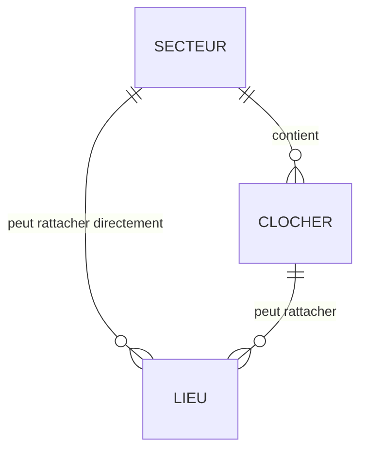
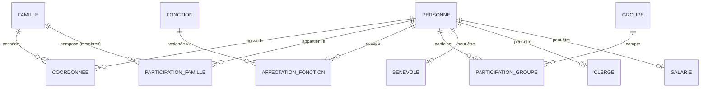
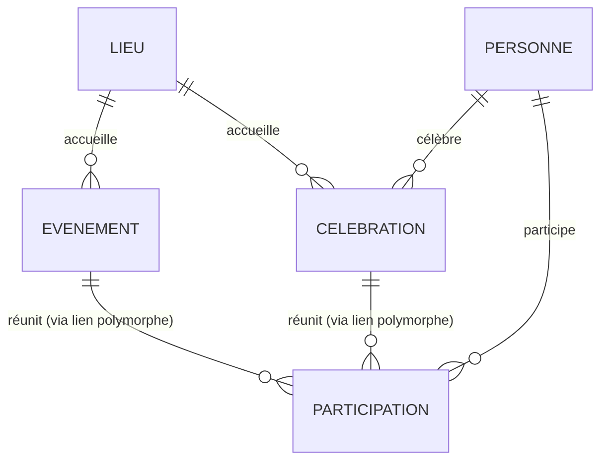
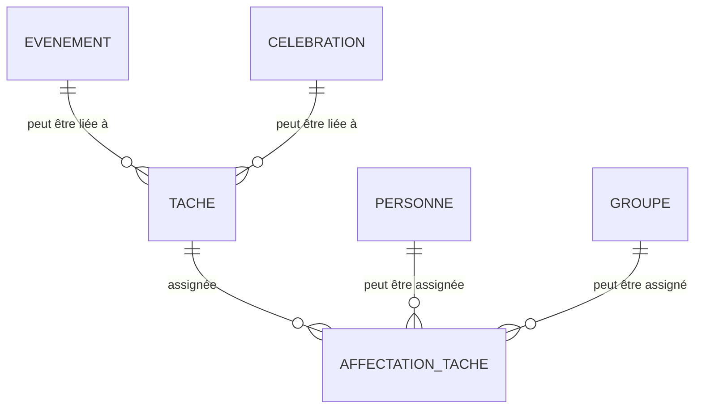
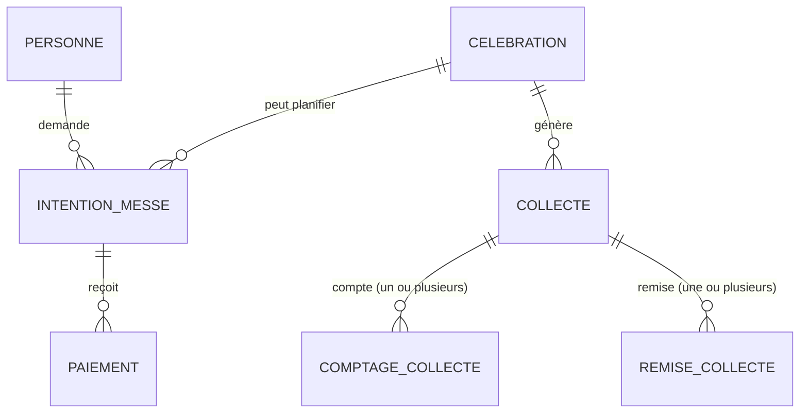
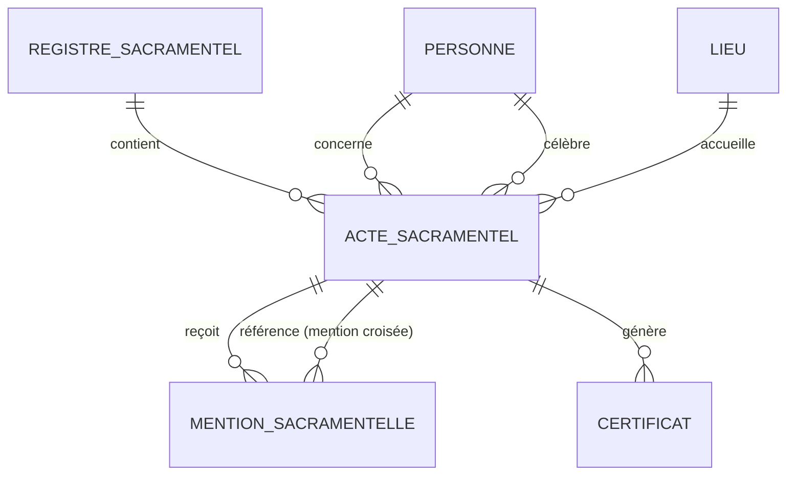
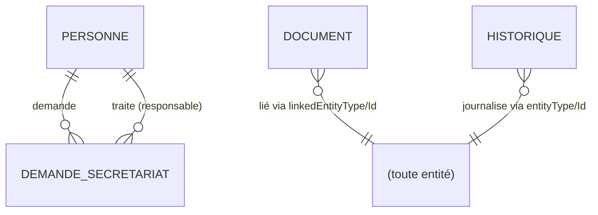
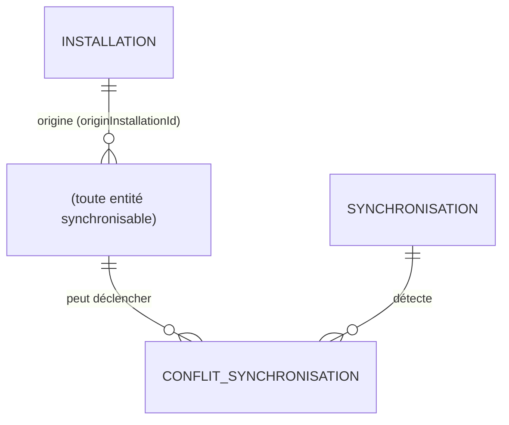

# Relations entre entités — gParoisse

Complète [ENTITIES.md](ENTITIES.md). Les diagrammes ci-dessous couvrent le
modèle **prévu** sur l'ensemble des versions (voir [ROADMAP.md](ROADMAP.md)
pour ce qui est réellement implémenté à un instant donné).

## Territoire

Un `Lieu` est indépendant : il référence `clocherId` **ou** `sectorId`
(les deux optionnels), jamais les deux à la fois en usage normal.

## Personnes & organisation

`Benevole`/`Clerge`/`Salarie` sont des extensions 1-1 optionnelles de
`Personne` (une personne peut cumuler plusieurs de ces profils — un
diacre peut aussi être salarié).

## Agenda & célébrations

`Participation` est polymorphe (`subjectType` + `subjectId`) pour éviter
deux tables quasi identiques (`ParticipationEvenement` /
`ParticipationCelebration`).

## Tâches

## Intentions & quêtes

## Sacrements

## Secrétariat, fournisseurs, documents, historique

`Document` et `Historique` référencent une entité quelconque par
`(entityType, entityId)` plutôt que par une clé étrangère typée par
table : c'est un lien polymorphe volontaire, seule façon d'attacher un
document ou de journaliser une action sur n'importe quel type
d'enregistrement sans dupliquer le mécanisme pour chaque entité.

## Synchronisation

Voir [SYNCHRONIZATION.md](SYNCHRONIZATION.md) pour la logique de fusion.

## Corbeille

Pas d'entité ni de relation propre : une vue calculée sur toute entité
dont `deletedAt` n'est pas `null`, via le registre des entités
synchronisables (mis en place en V9).
